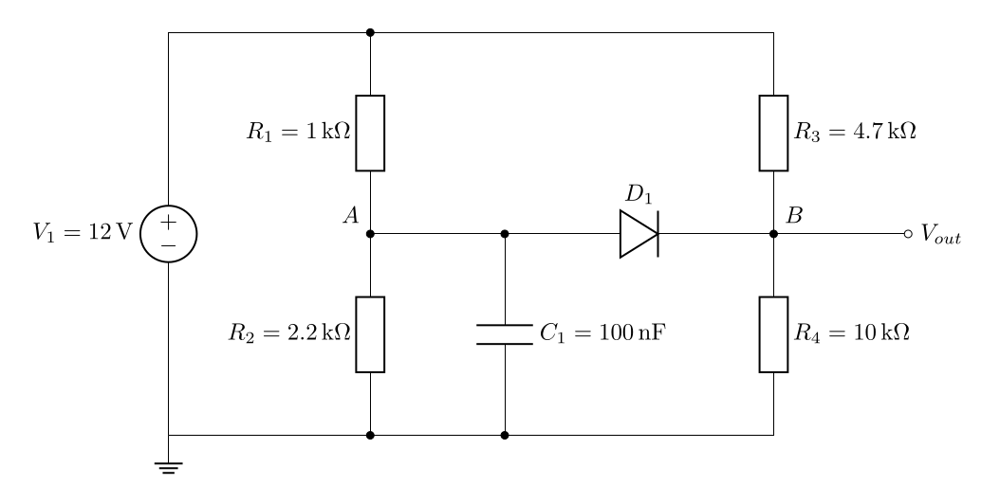

# Circuit Diagram Generator

An agent skill for turning circuit descriptions or schematic images into editable
LaTeX/CircuiTikZ diagrams. The agent interprets topology and authors TeX; the Python
helpers compile it to PDF and optionally SVG/PNG. This is not an image recognition
model, simulator, PCB tool, or automatic electrical-rule checker.



This preview is a newly authored test circuit with source and terminal ground truth
in `tests/fixtures/`. The original `photo.png` was Base64 text containing a corrupt
PNG; its exact bytes are retained as `tests/fixtures/original-photo.png.base64`.

## Install the complete skill

Copy or clone the **whole folder**, including `scripts/`, `assets/`, and
`references/`, into your agent's skills directory. Copying `SKILL.md` alone is not
sufficient. For Codex's conventional user skills directory:

```bash
git clone https://github.com/yangwinnietang/Agent-Skill-Automated-circuit-diagram-synthesis.git \
  ~/.codex/skills/circuit-diagram-generator
```

Follow your agent host's skill installation workflow if it manages skills itself.
The clone command installs the repository's default branch; to try an unmerged
improvement, explicitly select its branch or commit.

## Dependencies

- Python **3.9+**, no third-party Python packages for the helpers/tests.
- A working LaTeX distribution with `standalone`, `amsmath`, PGF/TikZ and `circuitikz`.
- PDF: `pdflatex` by default; `xelatex` and `lualatex` are selectable.
- SVG: Poppler's `pdftocairo` **or** `pdf2svg`, plus `pdfinfo`.
- PNG: Poppler's `pdftocairo` and `pdfinfo`.
- Chinese template: XeLaTeX, `ctex`, `xeCJK`, and Fandol fonts.

For example, on Debian/Ubuntu with package installation permission:

```bash
sudo apt-get install texlive-latex-base texlive-latex-extra texlive-pictures poppler-utils
# For Chinese labels:
sudo apt-get install texlive-xetex texlive-lang-chinese
# For the optional LuaLaTeX engine:
sudo apt-get install texlive-luatex
```

On other systems, install equivalent packages with your TeX distribution and
package manager. The script does not install dependencies or need network access.
Test the actual environment, including format files and fonts:

```bash
python scripts/compile_circuit.py --check --format svg --format png
```

## Use with an agent

Example requests:

- “Draw a 5 V divider using two 10 kΩ resistors. Label the midpoint Vout and give me TeX and SVG.”
- “Reconstruct this schematic photo. Preserve its values, polarity, open terminals, and resistor style; ask about unreadable connections.”
- “Draw an ideal inverting op-amp with 10 kΩ input and 100 kΩ feedback resistors. Omit power pins explicitly.”

The skill first identifies terminal connections, then draws, compiles, and visually
checks the result. Rectangular resistors are a default preference, not a universal
standard. User/image style takes precedence. Ambiguous image topology must remain
explicitly unresolved until clarified.

## Run without an agent

```bash
python scripts/example.py --list
python scripts/example.py --name divider --output-dir build/divider --compile --format svg --format png
python scripts/compile_circuit.py build/divider/divider.tex --format svg --format png
python scripts/compile_circuit.py assets/template-zh.tex --engine xelatex --output-dir build/chinese --format png
```

`example.py` refuses to overwrite existing TeX. Edit that copy and call
`compile_circuit.py` to rebuild it. Paths are resolved correctly from any working
directory; source-relative `\input` and images remain relative to the TeX file.
The source filename need not be a valid TeX job name.

| Option | Behavior |
|---|---|
| `--output-dir DIR` | Default: source directory; creates missing directories |
| `--format pdf/svg/png` | Repeat for desired exports; PDF is always retained; default PDF only |
| `--engine pdflatex/xelatex/lualatex` | Explicit engine; default `pdflatex` |
| `--timeout N` | Finite positive seconds per command; default 60 |
| `--passes N` | 1–3 LaTeX runs; default 2 |
| `--dpi N` | PNG resolution, 36–1200; default 180 |
| `--check` | Compile the bundled default template, including requested conversions |

Exit codes: **0** success, **1** build/dependency/I/O failure, **2** invalid CLI
syntax. Compilation/conversion logs are saved as `<name>.compile.log` (preflight
errors may occur before a log exists). `--check` uses temporary files and prints
failure diagnostics before cleanup. Requested export failures are fatal. SVG/PNG
requires a one-page PDF; multi-page input is rejected instead of silently losing
pages. PDF-only compilation can retain multiple pages.

Compilation uses a fresh temporary job, bounded commands, disabled shell escape,
and per-file atomic replacement after all requested conversions succeed. On a
compile/conversion failure, existing outputs are preserved and **may be stale**;
only the paths printed after a successful run represent the current build.
Successful builds also keep warnings in the log. Missing-glyph diagnostics are
fatal so unsupported labels are not silently omitted. Output publication is atomic
per file, not a multi-file transaction; an I/O failure during publication can leave
only some outputs updated. Use separate output directories for concurrent builds
of the same source basename.

The original import remains available: `compile_circuit(path)` returns `bool`.
For structured results, use `build(path, formats=("pdf", "svg"))`, which returns
`BuildResult(artifacts, log, warnings)` and raises `BuildError`. Default SVG export
is now opt-in to make dependencies and deliverables predictable.

## Validation and limits

See [TESTING.md](TESTING.md) for the reproducible test suite, actual results and
scope. Complete examples cover dividers, RC/RLC, a Wheatstone bridge, diode,
current source, switch, NPN/MOSFET, op-amp, logic and crossing/junction semantics.

A compiled diagram can still be electrically wrong. The agent must check terminal
connections, device pins, polarity, labels and crossings against the input and
inspect the rendered output. Board photos may hide connectivity that cannot be
recovered without additional information. Disabled shell escape is **not** a
sandbox for hostile TeX; use a properly isolated environment for untrusted source.

## License

The original README declared MIT licensing. This repository currently has no
standalone LICENSE file; the maintainer should confirm the intended copyright
notice before one is added.
