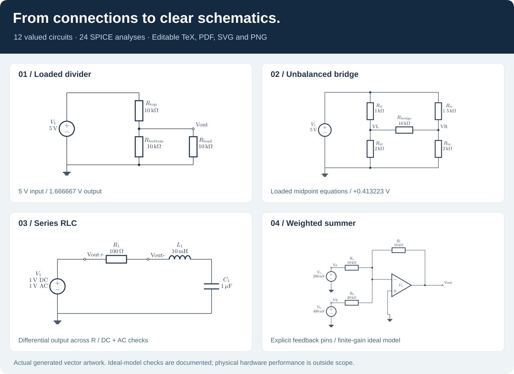

# Circuit Diagram Generator

**Turn circuit descriptions and schematic images into clear, editable engineering diagrams.**

[](https://github.com/yangwinnietang/Agent-Skill-Automated-circuit-diagram-synthesis/actions/workflows/test.yml)
[](#dependencies)
[](docs/gallery/README.md)
[](#try-it)

[](docs/gallery/README.md)

A reusable agent skill built around **CircuiTikZ**, with standard-library Python
helpers for reliable compilation and optional **ngspice** verification. Your agent
resolves the topology; editable source, explicit connections, and reproducible
checks make the result reviewable.

[Explore all 12 circuits](docs/gallery/README.md) · [Use the skill](SKILL.md) ·
[Verification evidence](TESTING.md) · [中文说明](#中文说明)

## Why use it?

- **Connections before decoration.** Component terminals, source polarity, branch
  junctions and measurement direction are resolved before drawing.
- **Editable, reusable outputs.** Keep TeX for revisions, PDF for documents, SVG for
  crisp figures and PNG for previews. Chinese labels have a dedicated XeLaTeX path.
- **One terminal model for drawing and analysis.** Supported linear circuits can
  generate both CircuiTikZ and SPICE from the same JSON specification.
- **Evidence beyond a successful render.** The valued gallery includes independent
  analytic expectations, actual DC/AC results, raw simulator output and individual
  visual inspection notes.
- **Failures stay visible.** Missing glyphs, missing exports, malformed simulator
  output and numerical mismatches fail explicitly. Existing deliverables are
  protected from failed rebuilds.

## Try it

Clone the repository, install the [dependencies](#dependencies), then generate and
verify the loaded divider:

```bash
git clone https://github.com/yangwinnietang/Agent-Skill-Automated-circuit-diagram-synthesis.git
cd Agent-Skill-Automated-circuit-diagram-synthesis

python scripts/synthesize.py assets/verified-circuits/divider-loaded.json \
  --output-dir build/loaded --format svg --format png --verify
```

The 5 V source and three 10 kΩ resistors produce **Vout = 1.666666667 V**. The load
is in parallel with the lower resistor; treating the circuit as an unloaded divider
would incorrectly give 2.5 V.

Your output directory contains editable TeX, PDF/SVG/PNG, a connection table, a
SPICE netlist, and a simulation folder with raw data and a JSON comparison report.
Use a new directory or `--overwrite` to rebuild existing generated output.
Omit `--verify` when you only need drawing; omit `--format` for source-only output.

To regenerate **all 12 diagrams and all numerical checks**:

```bash
python scripts/build_gallery.py --output-dir build/gallery
```

## A gallery you can inspect

All 12 diagrams have values, editable sources, three rendered formats, terminal
maps, and actual ngspice evidence. Every nonground node voltage is checked. The
four filter cases also compare complex outputs at 100 Hz, 1591.549431 Hz, and 10 kHz.

| Circuit | Main result under the stated model | Source, images and checks |
|---|---|---|
| Unloaded divider | 5 V → 2.5 V | [Open](docs/gallery/divider-unloaded/README.md) |
| Loaded divider | 5 V → 1.666666667 V | [Open](docs/gallery/divider-loaded/README.md) |
| Parallel resistors | 3 mA into 1 kΩ ∥ 2 kΩ → 2 V | [Open](docs/gallery/parallel-current/README.md) |
| Balanced bridge | V(left, right) = 0 V | [Open](docs/gallery/bridge-balanced/README.md) |
| Unbalanced bridge | V(left, right) = +0.4132231405 V | [Open](docs/gallery/bridge-unbalanced/README.md) |
| RC low-pass | At fc: −3.0103 dB, −45° | [Open](docs/gallery/rc-lowpass/README.md) |
| RC high-pass | At fc: −3.0103 dB, +45° | [Open](docs/gallery/rc-highpass/README.md) |
| RL low-pass | Output across R; at fc: −3.0103 dB | [Open](docs/gallery/rl-lowpass/README.md) |
| Series RLC | Output across R; at resonance: 0 dB, 0° | [Open](docs/gallery/series-rlc/README.md) |
| Inverting amplifier | 0.1 V → −0.9999890001 V | [Open](docs/gallery/opamp-inverting/README.md) |
| Noninverting amplifier | 0.1 V → +1.0999879001 V | [Open](docs/gallery/opamp-noninverting/README.md) |
| Weighted summer | 0.2 V, 0.4 V → −0.3999990000 V | [Open](docs/gallery/opamp-summer/README.md) |

The three amplifiers use **signal-only VCVS models with open-loop gain 10⁶**.
Their small deviation from the infinite-gain result is intentional. Supply rails,
saturation, bandwidth and current limits are omitted. See the
[independent derivations](docs/validation/analytic-reference.md) and
[per-diagram visual review](docs/validation/visual-review.md).

## Install as an agent skill

Install the **whole repository**, including `scripts/`, `assets/` and `references/`.
For a host using the conventional `~/.codex/skills/` directory:

```bash
git clone https://github.com/yangwinnietang/Agent-Skill-Automated-circuit-diagram-synthesis.git \
  ~/.codex/skills/circuit-diagram-generator
```

If your agent host manages skills itself, use its installation workflow. Copying
only `SKILL.md` omits the runnable tools and templates.

Example prompts:

> Draw a 5 V divider with two 10 kΩ resistors and a 10 kΩ load. Verify the loaded
> output voltage, then deliver editable TeX, SVG and a connection table.

> Reconstruct this schematic image. Preserve component values and polarity;
> identify ambiguous crossings before drawing. Do not guess unreadable labels.

> Draw a 1 kΩ / 100 nF RC high-pass. Check its DC output and complex gain at the
> corner frequency. Export a publication-ready vector figure.

For arbitrary devices, use the freeform CircuiTikZ workflow. The original 12
runnable examples also cover diodes, NPN/MOSFETs, logic, switches and wire crossings:

```bash
python scripts/example.py --list
python scripts/example.py --name mosfet-switch --output-dir build/mosfet --compile --format svg
python scripts/compile_circuit.py assets/template-zh.tex \
  --engine xelatex --output-dir build/chinese --format png
```

These broader examples are render-tested; the linear verifier does not simulate
semiconductor or logic models. [CLI details](references/cli.md) ·
[Structured JSON guide](references/structured-circuits.md) ·
[Photo reconstruction guide](references/image-reconstruction.md)

## Dependencies

Python **3.9+**; no third-party Python packages for the helpers or tests.

| Capability | Required tools |
|---|---|
| PDF | LaTeX with CircuiTikZ, PGF/TikZ, standalone, amsmath; Latin Modern for structured examples |
| SVG / PNG | Poppler: `pdftocairo` and `pdfinfo` (SVG also supports `pdf2svg`) |
| Numerical verification | `ngspice` on PATH |
| Chinese labels | XeLaTeX, ctex/xeCJK and Fandol fonts |
| Optional third engine | LuaLaTeX |

Example Debian/Ubuntu installation:

```bash
sudo apt-get install texlive-latex-base texlive-latex-extra texlive-pictures lmodern poppler-utils ngspice
# Optional Chinese and LuaLaTeX support:
sudo apt-get install texlive-xetex texlive-lang-chinese texlive-luatex

python scripts/compile_circuit.py --check --format svg --format png
ngspice --version
```

Use equivalent TeX and system packages on macOS or Windows. The scripts do not
install software and need no network access once dependencies are present.

## Verification and scope

The gallery records **24 actual analyses and 81 voltage comparisons**, with
`1e-9 V + 1e-6 × |expected|` tolerance. Additional tests exercise invalid topology,
reversed polarity, wrong loads, malformed outputs, parameter variation, Unicode
paths, compilation failures, and three real LaTeX engines. See
[TESTING.md](TESTING.md) for commands, exact coverage and results.

A schematic and an ideal-model comparison are engineering aids. They do not
certify real hardware, feedback stability, component ratings or PCB connectivity.
Images can hide ambiguous or missing wires; such uncertainty must be stated. The
compiler disables shell escape but is not a security sandbox for hostile TeX.

## 中文说明

本技能支持从文字或电路图像整理连接关系，生成可编辑的 CircuiTikZ 电路图，并导出
PDF、SVG、PNG。新增的 12 个带参数案例均提供连接表、独立理论计算与真实 ngspice
验证记录；每张图都单独检查元件、接线、极性和可读性。

线性电路可以使用 JSON 同时生成图纸与 SPICE 网表；二极管、晶体管、逻辑门等可使用
自由 CircuiTikZ 绘图流程。照片中的模糊标注和接线歧义应明确指出，不能自动猜测后声称
完全复原。理想模型验证通过也不代表真实硬件性能或安全认证。

## Contributing and licensing

For a new verified example, include its terminal specification, an independent
calculation, rendered outputs and tests. Keep rendering claims separate from
numerical verification. Use [TESTING.md](TESTING.md) to reproduce the checks.

The original README declared MIT licensing. A standalone LICENSE file and its
copyright notice have not yet been supplied by the maintainer.
