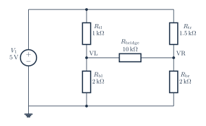

# Unbalanced Wheatstone bridge

[PDF](bridge-unbalanced.pdf) · [PNG](bridge-unbalanced.png) · [Editable TeX](bridge-unbalanced.tex) · [Connections](bridge-unbalanced.connections.md) · [JSON specification](../../../assets/verified-circuits/bridge-unbalanced.json) · [Simulation report](bridge-unbalanced.simulation/report.json)

Generated from one terminal model shared by the drawing and SPICE exporter. Expected values come from the [independent analytic reference](../../validation/analytic-reference.md). Voltage measurements use V(positive, negative); AC values are complex volts.

| Analysis | Measurement | Expected (V) | ngspice (V) | Absolute error (V) | Result |
|---|---|---:|---:|---:|---|
| DC | V_vcc | 5 | 5 | 0 | PASS |
| DC | V_left | 3.305785124 | 3.305785124 | 4.44e-16 | PASS |
| DC | V_right | 2.892561983 | 2.892561983 | 4.44e-16 | PASS |
| DC | output | 0.4132231405 | 0.4132231405 | 0 | PASS |

All node voltages are checked. The `output` measurement can be differential; for the RLC example it is the voltage across R, not a node-to-ground voltage.

Model assumptions:

- Vout = VL - VR = +0.4132231405 V; the left midpoint is positive.
- The 10 kOhm bridge loads both divider legs; its current is 41.32231405 uA left to right.

Raw simulator output, each netlist, and process logs are retained beside the JSON report. Rendering and these ideal-model comparisons do not certify component ratings, PCB connectivity, or physical circuit performance.
