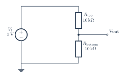

# Unloaded voltage divider

[PDF](divider-unloaded.pdf) · [PNG](divider-unloaded.png) · [Editable TeX](divider-unloaded.tex) · [Connections](divider-unloaded.connections.md) · [JSON specification](../../../assets/verified-circuits/divider-unloaded.json) · [Simulation report](divider-unloaded.simulation/report.json)

Generated from one terminal model shared by the drawing and SPICE exporter. Expected values come from the [independent analytic reference](../../validation/analytic-reference.md). Voltage measurements use V(positive, negative); AC values are complex volts.

| Analysis | Measurement | Expected (V) | ngspice (V) | Absolute error (V) | Result |
|---|---|---:|---:|---:|---|
| DC | V_vcc | 5 | 5 | 0 | PASS |
| DC | V_out | 2.5 | 2.5 | 0 | PASS |
| DC | output | 2.5 | 2.5 | 0 | PASS |

All node voltages are checked. The `output` measurement can be differential; for the RLC example it is the voltage across R, not a node-to-ground voltage.

Model assumptions:

- Unloaded ideal divider: Vout = 5 V times 10 kOhm / 20 kOhm = 2.5 V.

Raw simulator output, each netlist, and process logs are retained beside the JSON report. Rendering and these ideal-model comparisons do not certify component ratings, PCB connectivity, or physical circuit performance.
