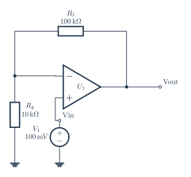

# Noninverting amplifier

[PDF](opamp-noninverting.pdf) · [PNG](opamp-noninverting.png) · [Editable TeX](opamp-noninverting.tex) · [Connections](opamp-noninverting.connections.md) · [JSON specification](../../../assets/verified-circuits/opamp-noninverting.json) · [Simulation report](opamp-noninverting.simulation/report.json)

Generated from one terminal model shared by the drawing and SPICE exporter. Expected values come from the [independent analytic reference](../../validation/analytic-reference.md). Voltage measurements use V(positive, negative); AC values are complex volts.

| Analysis | Measurement | Expected (V) | ngspice (V) | Absolute error (V) | Result |
|---|---|---:|---:|---:|---|
| DC | V_vin | 0.1 | 0.1 | 0 | PASS |
| DC | V_sum | 0.09999890001 | 0.09999890001 | 0 | PASS |
| DC | V_out | 1.0999879 | 1.0999879 | 1.57e-11 | PASS |
| DC | output | 1.0999879 | 1.0999879 | 1.57e-11 | PASS |

All node voltages are checked. The `output` measurement can be differential; for the RLC example it is the voltage across R, not a node-to-ground voltage.

Model assumptions:

- Signal-only ideal opamp: supply pins are intentionally omitted. SPICE uses Vout = 1e6 times (Vplus - Vminus).
- Infinite-gain result: Vout = 11 Vin = 1.1 V. The finite-gain check expects 1.099987900133 V.
- The input source connects to the positive input; Rg and Rf form negative feedback. No output limits are modeled.

Raw simulator output, each netlist, and process logs are retained beside the JSON report. Rendering and these ideal-model comparisons do not certify component ratings, PCB connectivity, or physical circuit performance.
