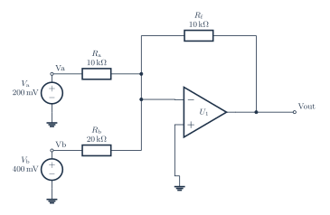

# Inverting weighted summer

[PDF](opamp-summer.pdf) · [PNG](opamp-summer.png) · [Editable TeX](opamp-summer.tex) · [Connections](opamp-summer.connections.md) · [JSON specification](../../../assets/verified-circuits/opamp-summer.json) · [Simulation report](opamp-summer.simulation/report.json)

Generated from one terminal model shared by the drawing and SPICE exporter. Expected values come from the [independent analytic reference](../../validation/analytic-reference.md). Voltage measurements use V(positive, negative); AC values are complex volts.

| Analysis | Measurement | Expected (V) | ngspice (V) | Absolute error (V) | Result |
|---|---|---:|---:|---:|---|
| DC | V_va | 0.2 | 0.2 | 0 | PASS |
| DC | V_vb | 0.4 | 0.4 | 0 | PASS |
| DC | V_sum | 3.99999e-07 | 3.99999e-07 | 0 | PASS |
| DC | V_out | -0.399999 | -0.399999 | 5.55e-17 | PASS |
| DC | output | -0.399999 | -0.399999 | 5.55e-17 | PASS |

All node voltages are checked. The `output` measurement can be differential; for the RLC example it is the voltage across R, not a node-to-ground voltage.

Model assumptions:

- Signal-only ideal opamp: supply pins are intentionally omitted. SPICE uses Vout = 1e6 times (Vplus - Vminus).
- Vout = -(Va + 0.5 Vb) = -0.4 V for infinite gain; the finite-gain check expects -0.399999000003 V.
- Ra and Rb meet only at the negative summing node. No saturation, bandwidth, or output-current limits are modeled.

Raw simulator output, each netlist, and process logs are retained beside the JSON report. Rendering and these ideal-model comparisons do not certify component ratings, PCB connectivity, or physical circuit performance.
