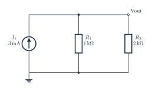

# Parallel resistors with upward current source

[PDF](parallel-current.pdf) · [PNG](parallel-current.png) · [Editable TeX](parallel-current.tex) · [Connections](parallel-current.connections.md) · [JSON specification](../../../assets/verified-circuits/parallel-current.json) · [Simulation report](parallel-current.simulation/report.json)

Generated from one terminal model shared by the drawing and SPICE exporter. Expected values come from the [independent analytic reference](../../validation/analytic-reference.md). Voltage measurements use V(positive, negative); AC values are complex volts.

| Analysis | Measurement | Expected (V) | ngspice (V) | Absolute error (V) | Result |
|---|---|---:|---:|---:|---|
| DC | V_out | 2 | 2 | 0 | PASS |
| DC | output | 2 | 2 | 0 | PASS |

All node voltages are checked. The `output` measurement can be differential; for the RLC example it is the voltage across R, not a node-to-ground voltage.

Model assumptions:

- The current-source arrow points upward, from ground into the shared top node.
- Vout = 2 V; resistor currents are 2 mA through R1 and 1 mA through R2.

Raw simulator output, each netlist, and process logs are retained beside the JSON report. Rendering and these ideal-model comparisons do not certify component ratings, PCB connectivity, or physical circuit performance.
