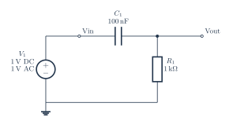

# RC high-pass filter

[PDF](rc-highpass.pdf) · [PNG](rc-highpass.png) · [Editable TeX](rc-highpass.tex) · [Connections](rc-highpass.connections.md) · [JSON specification](../../../assets/verified-circuits/rc-highpass.json) · [Simulation report](rc-highpass.simulation/report.json)

Generated from one terminal model shared by the drawing and SPICE exporter. Expected values come from the [independent analytic reference](../../validation/analytic-reference.md). Voltage measurements use V(positive, negative); AC values are complex volts.

| Analysis | Measurement | Expected (V) | ngspice (V) | Absolute error (V) | Result |
|---|---|---:|---:|---:|---|
| DC | V_vin | 1 | 1 | 0 | PASS |
| DC | V_out | 0 | 0 | 0 | PASS |
| DC | output | 0 | 0 | 0 | PASS |
| AC 100 Hz | V_vin | 1 +0j | 1 +0j | 0 | PASS |
| AC 100 Hz | V_out | 0.003932317593 +0.06258477827j | 0.003932317593 +0.06258477827j | 1.4e-17 | PASS |
| AC 100 Hz | output | 0.003932317593 +0.06258477827j | 0.003932317593 +0.06258477827j | 1.4e-17 | PASS |
| AC 1591.54943 Hz | V_vin | 1 +0j | 1 +0j | 0 | PASS |
| AC 1591.54943 Hz | V_out | 0.5 +0.5j | 0.5 +0.5j | 0 | PASS |
| AC 1591.54943 Hz | output | 0.5 +0.5j | 0.5 +0.5j | 0 | PASS |
| AC 10000 Hz | V_vin | 1 +0j | 1 +0j | 0 | PASS |
| AC 10000 Hz | V_out | 0.975295477 +0.1552230961j | 0.975295477 +0.1552230961j | 1.14e-16 | PASS |
| AC 10000 Hz | output | 0.975295477 +0.1552230961j | 0.975295477 +0.1552230961j | 1.14e-16 | PASS |

All node voltages are checked. The `output` measurement can be differential; for the RLC example it is the voltage across R, not a node-to-ground voltage.

Model assumptions:

- The output is across the resistor; DC is blocked.
- Ideal components and no external output load. Source: DC 1 V and AC 1 V.
- Corner frequency = 1591.549431 Hz; expected AC values are also the voltage gain.

Raw simulator output, each netlist, and process logs are retained beside the JSON report. Rendering and these ideal-model comparisons do not certify component ratings, PCB connectivity, or physical circuit performance.
