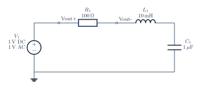

# Series RLC, output across resistor

[PDF](series-rlc.pdf) · [PNG](series-rlc.png) · [Editable TeX](series-rlc.tex) · [Connections](series-rlc.connections.md) · [JSON specification](../../../assets/verified-circuits/series-rlc.json) · [Simulation report](series-rlc.simulation/report.json)

Generated from one terminal model shared by the drawing and SPICE exporter. Expected values come from the [independent analytic reference](../../validation/analytic-reference.md). Voltage measurements use V(positive, negative); AC values are complex volts.

| Analysis | Measurement | Expected (V) | ngspice (V) | Absolute error (V) | Result |
|---|---|---:|---:|---:|---|
| DC | V_vin | 1 | 1 | 0 | PASS |
| DC | V_rl | 1 | 1 | 0 | PASS |
| DC | V_lc | 1 | 1 | 0 | PASS |
| DC | output | 0 | 0 | 0 | PASS |
| AC 100 Hz | V_vin | 1 +0j | 1 +0j | 0 | PASS |
| AC 100 Hz | V_rl | 0.996036573 -0.06283086994j | 0.996036573 -0.06283086994j | 0 | PASS |
| AC 100 Hz | V_lc | 0.999984353 -0.0630798994j | 0.999984353 -0.0630798994j | 1.39e-17 | PASS |
| AC 100 Hz | output | 0.003963426971 +0.06283086994j | 0.003963426971 +0.06283086994j | 0 | PASS |
| AC 1591.54943 Hz | V_vin | 1 +0j | 1 +0j | 0 | PASS |
| AC 1591.54943 Hz | V_rl | 8.077935669e-32 +2.842170943e-16j | 0 +3.469446952e-16j | 6.27e-17 | PASS |
| AC 1591.54943 Hz | V_lc | -2.842170943e-16 -1j | -3.885780586e-16 -1j | 1.04e-16 | PASS |
| AC 1591.54943 Hz | output | 1 -2.842170943e-16j | 1 -3.469446952e-16j | 6.27e-17 | PASS |
| AC 10000 Hz | V_vin | 1 +0j | 1 +0j | 0 | PASS |
| AC 10000 Hz | V_rl | 0.9740285023 +0.1590502405j | 0.9740285023 +0.1590502405j | 2.78e-17 | PASS |
| AC 10000 Hz | V_lc | -0.02531363198 -0.004133492238j | -0.02531363198 -0.004133492238j | 3.58e-18 | PASS |
| AC 10000 Hz | output | 0.0259714977 -0.1590502405j | 0.0259714977 -0.1590502405j | 2.78e-17 | PASS |

All node voltages are checked. The `output` measurement can be differential; for the RLC example it is the voltage across R, not a node-to-ground voltage.

Model assumptions:

- Vout is the differential voltage across R1: V(vin) - V(rl), with positive polarity toward the source.
- The sequence is source to R1 to L1 to C1 to ground. No single node-to-ground voltage is Vout.
- Ideal band-pass response: resonance = 1591.549431 Hz and Q = 1. Source: DC 1 V and AC 1 V.

Raw simulator output, each netlist, and process logs are retained beside the JSON report. Rendering and these ideal-model comparisons do not certify component ratings, PCB connectivity, or physical circuit performance.
